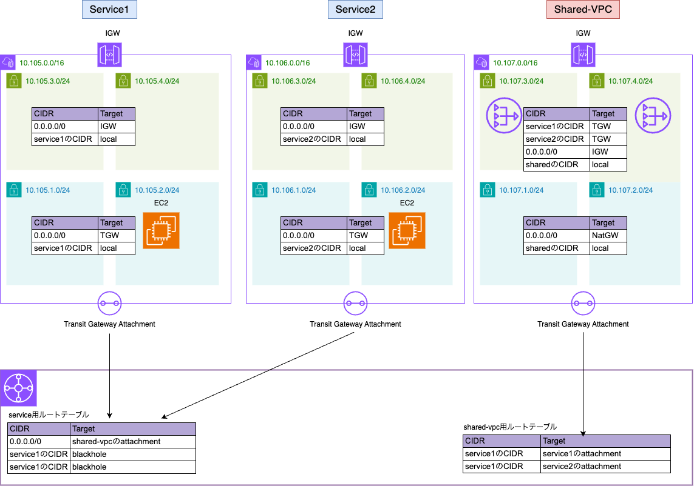

## 概要

複数VPCのインターネット通信を1つのVPCに集約する構成のサンプル
1.ワークロード間は通信できない。
2.ワークロードからインターネットへはshared-vpcを通じて出ることができる。

## Requirements

| Name | Version |
|------|---------|
|  [terraform](#requirement\_terraform) | >= 1.11.3 |
|  [aws](#requirement\_aws) | ~>5.93 |

## Providers

| Name | Version |
|------|---------|
|  [aws](#provider\_aws) | 5.93.0 |

## Modules

| Name | Source | Version |
|------|--------|---------|
|  [service1](#module\_service1) | terraform-aws-modules/vpc/aws | 5.0.0 |
|  [service1\_instance](#module\_service1\_instance) | terraform-aws-modules/ec2-instance/aws | 5.7.1 |
|  [service1\_instance\_sg](#module\_service1\_instance\_sg) | terraform-aws-modules/security-group/aws | v5.1.0 |
|  [service2](#module\_service2) | terraform-aws-modules/vpc/aws | 5.0.0 |
|  [service2\_instance](#module\_service2\_instance) | terraform-aws-modules/ec2-instance/aws | 5.7.1 |
|  [service2\_instance\_sg](#module\_service2\_instance\_sg) | terraform-aws-modules/security-group/aws | v5.1.0 |
|  [shared\_vpc](#module\_shared\_vpc) | terraform-aws-modules/vpc/aws | 5.0.0 |

## Resources

| Name | Type |
|------|------|
| [aws_ec2_network_insights_path.service1_to_service2_path](https://registry.terraform.io/providers/hashicorp/aws/latest/docs/resources/ec2_network_insights_path) | resource |
| [aws_ec2_network_insights_path.service1_to_shared_vpc_internetgateway_path](https://registry.terraform.io/providers/hashicorp/aws/latest/docs/resources/ec2_network_insights_path) | resource |
| [aws_ec2_transit_gateway.main](https://registry.terraform.io/providers/hashicorp/aws/latest/docs/resources/ec2_transit_gateway) | resource |
| [aws_ec2_transit_gateway_route.block_inter_services](https://registry.terraform.io/providers/hashicorp/aws/latest/docs/resources/ec2_transit_gateway_route) | resource |
| [aws_ec2_transit_gateway_route.natgw_to_service1_return](https://registry.terraform.io/providers/hashicorp/aws/latest/docs/resources/ec2_transit_gateway_route) | resource |
| [aws_ec2_transit_gateway_route.natgw_to_service2_return](https://registry.terraform.io/providers/hashicorp/aws/latest/docs/resources/ec2_transit_gateway_route) | resource |
| [aws_ec2_transit_gateway_route.service_last_resort](https://registry.terraform.io/providers/hashicorp/aws/latest/docs/resources/ec2_transit_gateway_route) | resource |
| [aws_ec2_transit_gateway_route_table.service](https://registry.terraform.io/providers/hashicorp/aws/latest/docs/resources/ec2_transit_gateway_route_table) | resource |
| [aws_ec2_transit_gateway_route_table.shared_route_table](https://registry.terraform.io/providers/hashicorp/aws/latest/docs/resources/ec2_transit_gateway_route_table) | resource |
| [aws_ec2_transit_gateway_route_table_association.service1](https://registry.terraform.io/providers/hashicorp/aws/latest/docs/resources/ec2_transit_gateway_route_table_association) | resource |
| [aws_ec2_transit_gateway_route_table_association.service2](https://registry.terraform.io/providers/hashicorp/aws/latest/docs/resources/ec2_transit_gateway_route_table_association) | resource |
| [aws_ec2_transit_gateway_route_table_association.shared](https://registry.terraform.io/providers/hashicorp/aws/latest/docs/resources/ec2_transit_gateway_route_table_association) | resource |
| [aws_ec2_transit_gateway_vpc_attachment.service1](https://registry.terraform.io/providers/hashicorp/aws/latest/docs/resources/ec2_transit_gateway_vpc_attachment) | resource |
| [aws_ec2_transit_gateway_vpc_attachment.service2](https://registry.terraform.io/providers/hashicorp/aws/latest/docs/resources/ec2_transit_gateway_vpc_attachment) | resource |
| [aws_ec2_transit_gateway_vpc_attachment.shared](https://registry.terraform.io/providers/hashicorp/aws/latest/docs/resources/ec2_transit_gateway_vpc_attachment) | resource |
| [aws_route.service1_to_tgw](https://registry.terraform.io/providers/hashicorp/aws/latest/docs/resources/route) | resource |
| [aws_route.service2_to_tgw](https://registry.terraform.io/providers/hashicorp/aws/latest/docs/resources/route) | resource |
| [aws_route.shared_to_service1](https://registry.terraform.io/providers/hashicorp/aws/latest/docs/resources/route) | resource |
| [aws_route.shared_to_service2](https://registry.terraform.io/providers/hashicorp/aws/latest/docs/resources/route) | resource |

## Inputs

No inputs.

## Outputs

| Name | Description |
|------|-------------|
|  [instance1\_id](#output\_instance1\_id) | n/a |
|  [instance2\_id](#output\_instance2\_id) | n/a |
